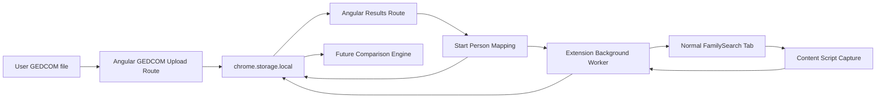

# Project Documentation

## Purpose

FamilySearch GEDCOM Compare is a local-first Angular Chrome extension for comparing a user-provided GEDCOM file against read-only data collected from FamilySearch pages.

The long-term flow is:

1. Upload a GEDCOM file into the extension app.
2. Select the corresponding starting person in the GEDCOM results view.
3. Paste that person's FamilySearch ID in the mapping route and retrieve the matching FamilySearch person details.
4. Traverse only the FamilySearch branches the GEDCOM says are relevant.
5. Store captured FamilySearch snapshots locally.
6. Compare normalized GEDCOM data against normalized FamilySearch data.
7. Show discrepancies as review cards.

The project is intentionally read-only with respect to FamilySearch. It should never automate edits back to FamilySearch.

## Important Constraints

- FamilySearch API access is not available for this project.
- Playwright/custom automation browser sessions were blocked by FamilySearch security tooling.
- The extension relies on the user's normal logged-in Chrome session for authentication, 2FA, and page access.
- FamilySearch collection should stay bounded, and user-started.
- Angular routes use hash routing because extension pages do not have server fallback routing.
- Chrome loads JavaScript files from the manifest, but the authored extension runtime source lives in TypeScript.
- Do not make changes to js files without asking for permission first, the majority of them are auto generated.

## Current Architecture



## Source Layout

- `src/app`: Angular extension app.
- `src/app/app.html`: Current app shell. It uses a top quick nav and a `main.workspace` area.
- `src/app/app.config.ts`: Angular app config with `withHashLocation()`.
- `src/app/app.routes.ts`: Routes for GEDCOM upload, GEDCOM results, and start-person mapping.
- `src/app/gedcom-upload`: GEDCOM upload UI plus browser-side GEDCOM parser/normalizer.
- `src/app/gedcom-results`: GEDCOM review cards, card settings, and GEDCOM starting-person selection.
- `src/app/mapping`: Mapping route that connects the selected GEDCOM starting person to a manually entered FamilySearch ID and displays retrieved FamilySearch details.
- `src/app/chrome-storage.service.ts`: Low-level injectable wrapper around `chrome.storage.local`.
- `src/app/extension-storage.service.ts`: Typed app storage facade for project-specific keys.
- `src/app/familysearch-person.service.ts`: Typed app facade for retrieving one FamilySearch person by explicit ID.
- `src/familysearch-person-url.ts`: Shared helper for FamilySearch person ID extraction and details URL construction.
- `src/Interfaces`: Shared TypeScript interfaces used across routes, components, and services.
- `src/extension`: Authored TypeScript source for the Chrome background worker and content script.
- `public/manifest.json`: Chrome MV3 manifest.
- `public/background.js` and `public/content-script.js`: Generated Chrome runtime files emitted from `src/extension/*.ts`.
- `scripts`: TypeScript-oriented build/check helpers.
- `extension/familysearch-collector`: Built unpacked extension output.
- `PROJECT_CHECKLIST.md`: Product and implementation checklist.
- `STYLES.md`: Code organization and TypeScript style rules.

## Angular App

The extension action opens the Angular app at:

```text
index.html#/gedcom
```

Current routes:

- `#/gedcom`: Upload a GEDCOM file, parse it, store normalized JSON locally, and show import summary.
- `#/results`: Show normalized GEDCOM review cards, card settings, storage debug panel, and GEDCOM starting-person selection.
- `#/mapping`: Type or paste a FamilySearch ID, retrieve that exact FamilySearch person, show the retrieved card, and save the ID against the selected GEDCOM starting person.

The app uses Angular's modern template control flow (`@if`, `@for`) and signal-driven state where practical. Prefer signals/computed state over manual UI synchronization when adding new features.

## GEDCOM Parsing

The browser-side parser is in `src/app/gedcom-upload/gedcom-parser.ts`.

It currently normalizes:

- GEDCOM metadata: source, version, charset, imported time.
- People: IDs, names, sex, core facts, parent family IDs, spouse family IDs.
- Families: husband IDs, wife IDs, children, family facts. The singular `husbandId`/`wifeId` fields remain for compatibility, and plural `husbandIds`/`wifeIds` preserve same-role spouse or parent entries.
- Relationships: parents, spouses, children, siblings.
- Facts: type, date, place, value, notes.
- Excess data stored in other fact/card sections.

The normalized document shape is stored as `NormalizedGedcomDocument`.

There is also a CLI-oriented converter under `src/gedcom` (should be depracated soon, cli isn't needed/wanted), used by:

```sh
npm run gedcom:convert -- --input "Wilson Family Tree.ged"
```

## Extension Storage

Storage uses `chrome.storage.local`

Important keys:

- `gedcomImport`: The uploaded and normalized GEDCOM import.
- `familySearchGedcomStartPersonMapping`: The selected GEDCOM starting person and optional FamilySearch ID.
- `familySearchGedcomCollectorState`: Background traversal/capture state from the extension runtime.

The results route includes a collapsible storage debug panel to inspect both typed import loading and raw extension storage.

## Start-Person Selection And Mapping

The results page currently lets the user:

- Pick a GEDCOM person card as the starting person.
- Persist that GEDCOM starting person to extension storage.

The mapping route currently lets the user:

- Paste or type a FamilySearch ID.
- Enter the ID without the dash; the UI formats it as `XXXX-XXX`.
- Retrieve the exact FamilySearch person details URL for that ID through the extension background worker.
- Display the retrieved FamilySearch person as a reusable person card.
- Persist the mapping to extension storage after retrieval succeeds.

FamilySearch IDs are treated as seven alphanumeric characters displayed as four characters, a dash, then three characters.

This is the first bridge between the GEDCOM graph and future FamilySearch traversal.

## Extension Runtime

Chrome loads:

- `background.js` as the MV3 service worker.
- `content-script.js` on `https://www.familysearch.org/*`.

Those files are generated from TypeScript:

- `src/extension/background.ts`
- `src/extension/content-script.ts`
- `src/extension/helpers.ts`

Build them with:

```sh
npm run extension:scripts
```

The background worker is responsible for:

- Opening the Angular extension page when the extension icon is clicked.
- Coordinating capture/traversal messages.
- Tracking queue, visited FamilySearch IDs, GEDCOM person IDs, active tab, records, and limits.
- Loading the stored GEDCOM import and start-person mapping for GEDCOM-guided traversal.
- Queueing only expected GEDCOM relatives: father, mother, GEDCOM-listed spouses, and children.
- Storing placeholder records when an expected GEDCOM relative is missing or ambiguous in the visible FamilySearch relationships.
- Navigating to direct FamilySearch person URLs.
- Storing traversal state in `chrome.storage.local`.

The content script is responsible for:

- Reading visible FamilySearch person page content.
- Extracting the visible page's FamilySearch person ID during capture/traversal.
- Extracting visible facts.
- Extracting related FamilySearch person IDs from links/text.
- Returning a raw page snapshot to the background worker.

## Build And Checks

Use Node 22 for the project.

Common commands:

```sh
npm install
npm run typecheck
npm run extension:build
npm test -- --watch=false
```

What they do:

- `npm run strict-types`: Scans active TypeScript source for explicit `any`.
- `npm run typecheck`: Runs strict type checks for app/spec/extension configs and verifies TS entrypoints bundle.
- `npm run extension:scripts`: Bundles TypeScript extension runtime files into Chrome-required JavaScript files in `public/`.
- `npm run extension:build`: Builds extension runtime scripts, builds Angular into `extension/familysearch-collector`, then validates the built extension.
- `npm run extension:check`: Checks the built manifest scripts and verifies the Angular extension page does not include inline script/style.

## Loading The Extension

1. Run `npm run extension:build`.
2. Open `chrome://extensions`.
3. Enable Developer Mode.
4. Click Load unpacked.
5. Select:

```text
/Users/Riley/Repos/FamilySearchGedcom/extension/familysearch-collector
```

After rebuilding, reload the unpacked extension from Chrome or use the app's Reload Extension button when available.

## Current Implementation Status

Working:

- Angular extension shell with hash routes.
- GEDCOM upload and normalized local storage.
- GEDCOM results cards.
- Card settings for relationship/residence/other sections.
- GEDCOM starting-person selection from the results cards.
- Mapping route from the selected GEDCOM card to a retrieved FamilySearch person card by manually entered ID.
- Extension runtime proof-of-concept for visible FamilySearch capture.
- GEDCOM-guided traversal from the mapped starting person through expected father, mother, spouse, and child branches.
- Missing/ambiguous expected relatives are stored as placeholder traversal records for future comparison UI.
- TypeScript source for extension runtime, bundled to manifest JavaScript.

Not done yet:

- Normalizing captured FamilySearch snapshots into a comparison model.
- Comparison engine.
- Final discrepancy card UI.
- Export/report flow for comparison results.

## Handoff Notes For Another Agent

- Start with `README.md`, this file, `PROJECT_CHECKLIST.md`, and `STYLES.md`.
- Do not reintroduce Playwright for FamilySearch browsing; it was explicitly blocked.
- Do not automate writes back to FamilySearch.
- Preserve hash routing for extension pages.
- Keep generated Chrome runtime JavaScript in `public/`, but edit TypeScript under `src/extension`.
- Prefer Angular signals/computed state and modern `@if`/`@for` templates.
- Avoid explicit `any`; use shared interfaces from `src/Interfaces` and narrow `unknown` values with type guards.
